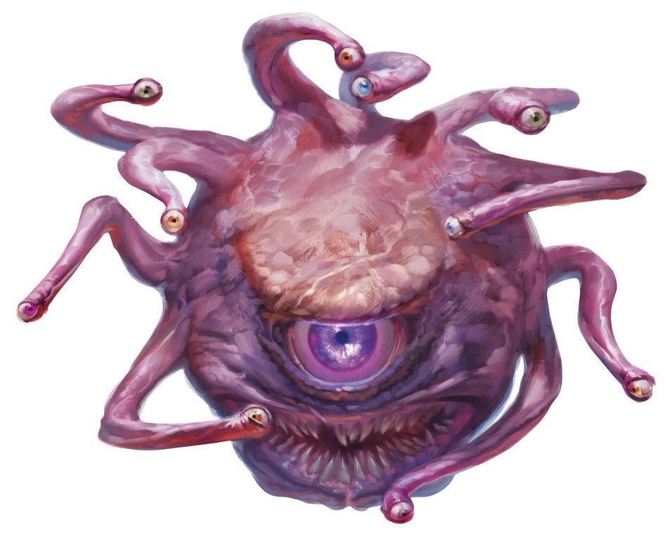

<h1 align="center">
  <br>
  
  <br>
  Kalius Discord Bot
  <br>
</h1>

<p align="center">
  <a href="#overview">Overview</a>
  •
  <a href="#license">License</a>
</p>

<p align="center">
  <a href="https://opensource.org/licenses/MIT">
    
  </a>
</p>

# Overview

Kalius is a discord bot that helps players and masters organizing rol games. 
This is a *self-hosted bot* – meaning you will need to host and maintain your own instance.

## Installation

- This is a node app, you can run it simply by executing ```npm start```.
- All the configuration parameters are in the file **config.js**

## Features:

- ```!comenzar``` will ask your name, age, location and other basic info to start your rol profile.
- //TODO ```!ayuda``` will show the complete list of commands that you can use.
- //TODO ```!rol {desired dice roll}``` will provide a random dice roll.
  - Example: ```!rol 2d10``` will perform a random 2 dice, 10 sides each. result -> ```5, 4```.
- //TODO ```!perfil``` will allow you to customize your profile.
  - Example: ```!perfil rol master``` will set your current discord rol to **master**.
- //TODO ```!generar {playerName|placeName}``` will generate a random **playerName** or **placeName**.


## Contributing
 
1. Fork it!
2. Create your feature branch: `git checkout -b my-new-feature`
3. Commit your changes: `git commit -am 'Add some feature'`
4. Push to the branch: `git push origin my-new-feature`
5. Submit a pull request ;-)

## License
Released under the [MIT](https://opensource.org/licenses/MIT) license.
